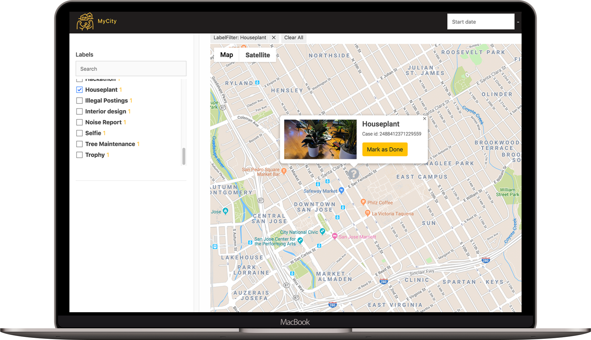
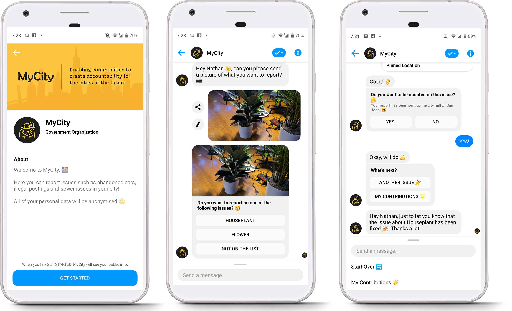
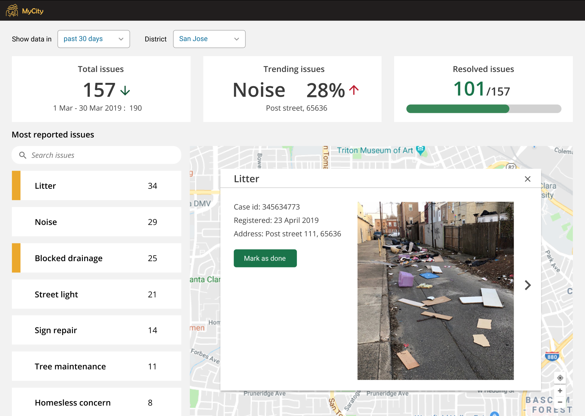
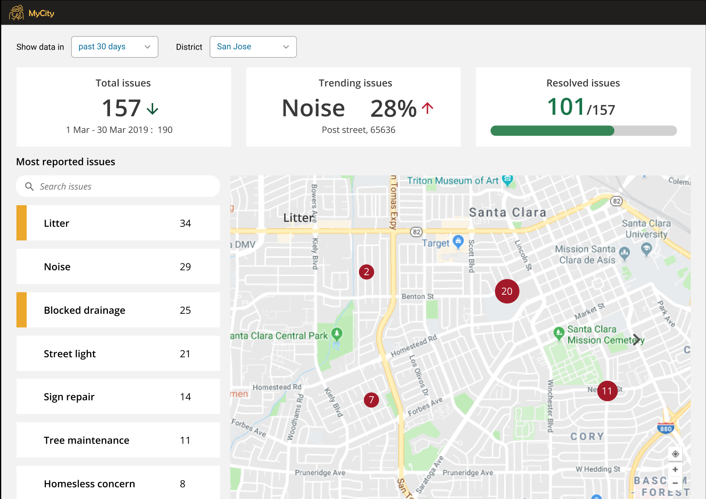

# F8 MyCity - UI

[http://f8-mycity.s3-website-us-east-1.amazonaws.com/](http://f8-mycity.s3-website-us-east-1.amazonaws.com/)

## Screenshots





## Screenshots (Future State)





## Setup

```bash
npm install
npm run start
```

## Push to S3

```bash
aws cloudformation create-stack \
  --stack-name "my-city-ui" \
  --template-body file://cloudformation/f8-s3.json \
  --parameters file://cloudformation/f8-s3-params.json
```

```bash
npm run build
aws s3 sync build/ s3://f8-mycity
```
